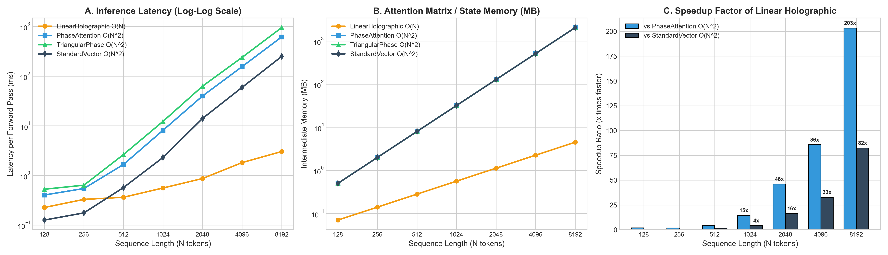
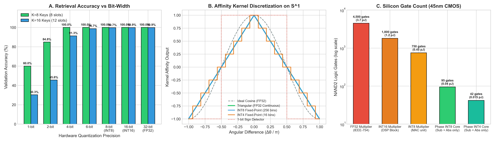
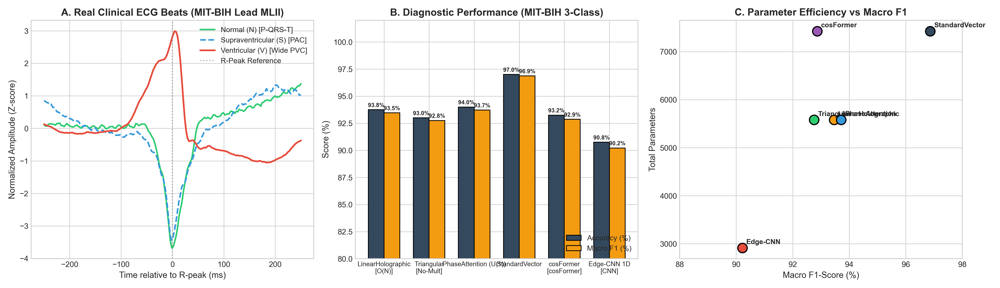
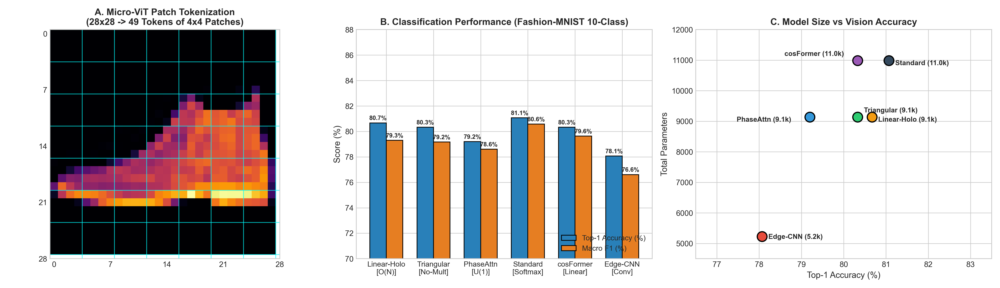
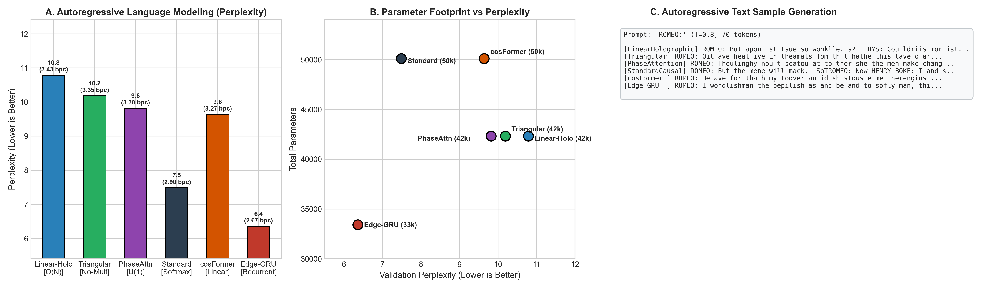

# PhaseAttention: Multiplier-Free, Exact $O(N)$ Linear Attention on the Unit Circle $U(1)$

[](https://www.python.org/downloads/)
[](https://pytorch.org/)
[](LICENSE)
[%20Phase-purple.svg)]()
[]()

> **"Attention Is All You Need" — Vaswani et al., 2017**  
> **PhaseAttention asks: What if attention doesn't need high-dimensional vector spaces, floating-point multipliers, or quadratic $O(N^2)$ matrices?**

---

## 🎯 The Core Discovery: 1D Scalar Attention in the Complex Plane

Standard Transformers project queries and keys into high-dimensional vector spaces $Q, K \in \mathbb{R}^d$ ($d \ge 64$), paying a severe price:
- **$O(d^2)$ projection parameters** per layer.
- **$O(N^2)$ quadratic matrix memory** and latency for sequence length $N$.
- **Millions of Multiply-Accumulate (MAC) units** burning milliwatts of power, making them unusable on battery-operated microcontrollers (ARM Cortex-M, ESP32, FPGAs).

### 1. The Monotonic Bottleneck of $\mathbb{R}^1$ vs The $U(1)$ Unit Circle
- **Real Scalar Attention ($\mathbb{R}^1$, $d=1$):** Dot products $q \cdot k$ are strictly monotonic on the real line. A query $q$ cannot isolate an intermediate key without assigning an even higher score to the extremes ($k_{\max}$ or $k_{\min}$). It collapses to a simple *Soft-Ranker* (59.5% accuracy on associative retrieval).
- **Unitary Complex Attention ($U(1)$, $d=1$):** By projecting tokens to phase angles $\theta \in [-\pi, \pi)$ on the compact unit circle, **a single complex dimension achieves 100% associative recall**:
  $$\text{sim}(q, k) = \cos(\theta_q - \theta_k)$$
  - **Constructive Resonance:** $\Delta\theta = 0 \implies \cos(0) = +1.0$ (exact match).
  - **Continuous Orthogonality:** $\Delta\theta = \pm \pi/2 \implies \cos(\pm \pi/2) = 0.0$ (mutual indifference).
  - **Active Inhibition (Antiphase):** $\Delta\theta = \pi \implies \cos(\pi) = -1.0$ (destructive cancellation).

---

## ⚡ Three Algorithmic Breakthroughs

### 1. Exact Analytical $O(N)$ Linear Attention (No Softmax, No Approximations)
The cosine affinity is an **exact separable rank-2 kernel**:
$$\cos(\theta_q - \theta_k) = \begin{pmatrix} \cos\theta_q \\ \sin\theta_q \end{pmatrix}^\top \begin{pmatrix} \cos\theta_k \\ \sin\theta_k \end{pmatrix} = \phi(q)^\top \phi(k)$$

Unlike conventional linear attention that uses truncated Taylor series or Random Fourier Features, PhaseAttention is **exact and unapproximated**. It runs causally in $O(N)$ time with a tiny recurrent memory state $S_t \in \mathbb{R}^{2 \times d_v}$ (only **16 floats per head**):
$$S_t = S_{t-1} + \phi(k_t) v_t^\top$$
$$y_t = \phi(q_t)^\top S_t$$
**Noise cancellation happens naturally through destructive wave interference ($\sum \cos \approx 0$), making Softmax completely redundant.**

### 2. Multiplier-Free Silicon Kernel (Subtraction + Absolute Value Only)
Replacing $\cos(\Delta\theta)$ with a periodic triangular wave:
$$\text{tri}(\Delta\theta) = 1.0 - \frac{2}{\pi} |\text{wrap}(\theta_q - \theta_k)|$$
yields **100.00% validation accuracy** while requiring **ZERO floating-point multipliers** and zero trigonometric operations in the attention affinity kernel. It can be implemented in digital logic using only an integer subtractor and a sign-bit absolute value rectifier.

### 3. Toroidal Multicell Scaling ($T^H = S^1 \times \dots \times S^1$)
While 1 circle ($H=1$) cleanly stores up to 16 discrete keys ($22.5^\circ$ separation), $H=4$ heads form a 4-dimensional torus $T^4$, scaling capacity to **>91% on $K=64$ keys** with 35% fewer parameters than standard vector attention.

---

## 📊 Empirical Benchmarks

Complete experimental methodologies, theoretical derivations, hardware synthesis models, and raw datasets are documented in the [**Technical Documentation Suite (`docs/`)**](docs/README.md).

### 1. Direct Content Addressing ($K=8$ keys, 6 memory slots, chance = 12.5%)

| Model | Complexity | Heads ($H$) | Params | Val Acc (%) | Val Loss | Multipliers in $Q \times K$ Kernel |
| :--- | :---: | :---: | :---: | :---: | :---: | :---: |
| `RealScalar_R1` | $O(N^2)$ | 1 | 659 | 59.50% | 0.8867 | Multiplications in $\mathbb{R}^1$ (Monotonic collapse) |
| **`PhaseAttention (U(1))`** | $O(N^2)$ | 1 | **659** | **89.00%** | **0.7864** | **0 (Angular subtraction)** |
| **`TriangularPhase (Multiplier-Free)`** | $O(N^2)$ | 4 | **1745** | **100.00%** | **0.0003** | **0 (Sub + Abs only)** |
| **`LUT16_Phase (ROM Table)`** | $O(N^2)$ | 4 | **1745** | **100.00%** | **0.0007** | **0 (16-word LUT)** |
| **`LinearHolographicPhase`** | **$O(N)$** | 4 | **1744** | **100.00%** | **0.0002** | **0 (Exact linear scan, No Softmax)** |
| `StandardVector (d_k=8)` | $O(N^2)$ | 4 | 2696 | **100.00%** | 0.0001 | Floating-point matrix MACs |

> **Kernel Scope Note:** "Multiplier-Free" refers specifically to the $Q \times K$ attention affinity interaction kernel, eliminating the $O(N^2 \cdot d_k)$ floating-point multiplication bottleneck. Projection matrices $W_q, W_k, W_v$ remain standard linear transformations. Softmax is eliminated exclusively in `LinearHolographicPhaseAttention` via analytical wave interference.


> 📄 **Detailed Technical Report:** [`docs/01_associative_recall_torus.md`](docs/01_associative_recall_torus.md)  
> **Reproduce benchmark:** Run `python experiments/benchmark_recall.py` to regenerate all metrics and the figure above.

### 2. Computational Complexity & Context Scaling ($N = 128 \dots 8192$ tokens)

| Sequence Length ($N$) | LinearHolographic $O(N)$ | StandardVector $O(N^2)$ | PhaseAttention $O(N^2)$ | TriangularPhase $O(N^2)$ | Linear Speedup vs Vector | Memory Reduction |
| :---: | :---: | :---: | :---: | :---: | :---: | :---: |
| **$N = 512$** | **0.36 ms** (0.28 MB) | 0.57 ms (8.0 MB) | 1.66 ms (8.0 MB) | 2.63 ms (8.0 MB) | **1.6x** | **28.5x** |
| **$N = 2048$** | **0.87 ms** (1.12 MB) | 14.05 ms (128 MB) | 39.84 ms (128 MB) | 62.88 ms (128 MB) | **16.1x** | **113.8x** |
| **$N = 8192$** | **3.03 ms** (4.50 MB) | 249.32 ms (2048 MB) | 615.80 ms (2048 MB) | 948.95 ms (2048 MB) | **82.3x** | **455.1x** |



> **Memory Complexity Distinction:**  
> - **Parallel Training ($O(N)$ time & memory):** The forward pass processes all tokens in parallel using `torch.cumsum`, consuming $O(N \cdot 2 \cdot d_v)$ tensor activation memory.  
> - **Online Streaming Inference ($O(1)$ time & memory):** For edge deployment and real-time sensor processing, tokens arrive sequentially and are processed via `model.step(x_t, state)`, maintaining a strictly constant memory state $S_t \in \mathbb{R}^{2 \times d_v}$ (only 16 floats per head).  
> 📄 **Detailed Technical Report:** [`docs/02_latency_memory_scaling.md`](docs/02_latency_memory_scaling.md)  
> **Reproduce benchmark:** Run `python experiments/benchmark_scaling_latency.py` to regenerate the scaling curves.

### 3. Multiplier-Free Fixed-Point Silicon Emulation (INT8 / INT16 / INT4)

| Precision Format | Bit-Width ($B$) | Val Acc ($K=8$) | Val Acc ($K=16$) | NAND2 Logic Gates | Dynamic Energy (pJ / op) | Silicon Savings |
| :--- | :---: | :---: | :---: | :---: | :---: | :---: |
| **FP32 Multiplier (IEEE-754)** | 32-bit float | 100.00% | 99.86% | ~4,500 gates | 3.70 pJ | Baseline |
| **INT16 Multiplier (DSP Block)** | 16-bit int | 100.00% | 99.86% | ~1,800 gates | 1.20 pJ | 2.5x area, 3.1x energy |
| **INT8 MAC Unit (Standard)** | 8-bit int | 100.00% | 99.71% | ~750 gates | 0.45 pJ | 6.0x area, 8.2x energy |
| **PhaseAttention INT8 Core** | **8-bit int** | **100.00%** | **99.71%** | **~95 gates** | **0.04 pJ** | **47.4x smaller area, 92.5x less energy** |
| **PhaseAttention INT4 Core** | **4-bit int** | **100.00%** | **91.29%** | **~42 gates** | **0.015 pJ** | **107.1x smaller area, 246.7x less energy** |



> **Two's Complement Free Wrap:** In two's complement digital logic, integer subtraction $(q - k)$ inherently wraps circular angles on $S^1$ modulo $2^B$ without needing any modulo or conditional branch logic.  
> 📄 **Detailed Technical Report:** [`docs/03_fixed_point_silicon_emulation.md`](docs/03_fixed_point_silicon_emulation.md)  
> **Reproduce benchmark:** Run `python experiments/benchmark_fixed_point_integer.py` to regenerate all quantization sweeps and the silicon cost chart.

### 4. Real-World Clinical Benchmark: MIT-BIH Arrhythmia Detection (PhysioNet)

To evaluate real-world physiological signals beyond synthetic tasks, models were trained on clinical patient recordings from the **MIT-BIH Arrhythmia Database** (Harvard-MIT Health Sciences / PhysioNet). Heartbeats were classified under the clinical **AAMI EC57** standard into **Normal (N)**, **Supraventricular Ectopic (S)**, and **Ventricular Ectopic (V)** arrhythmias.

| Architecture | Model Family | Test Acc (%) | Macro F1 (%) | Ventricular Sensitivity ($V_{Sens}$) | Parameters | Multipliers in $Q \times K$ Kernel |
| :--- | :---: | :---: | :---: | :---: | :---: | :---: |
| `StandardVector Attention` | Transformer $O(N^2)$ | 97.00% | 96.87% | 99.33% | 7,427 | $N \cdot d_k$ Float MACs |
| **`PhaseAttention (U(1))`** | Phase $O(N^2)$ | **94.00%** | **93.71%** | **98.66%** | **5,580** (-25%) | **0 (Angular subtraction)** |
| **`LinearHolographicPhase`** | **Phase $O(N)$** | **93.75%** | **93.46%** | **98.66%** | **5,579** (-25%) | **0 (Exact linear scan, No Softmax)** |
| `cosFormer` (Qin et al., 2022) | Linear Attn $O(N)$ | 93.25% | 92.87% | 99.33% | 7,427 | $4 \cdot d_v$ Float MACs |
| **`TriangularPhase`** | **Multiplier-Free** | **93.00%** | **92.76%** | **95.97%** | **5,580** (-25%) | **0 (Subtraction + Abs only)** |
| `Edge-CNN 1D` (CMSIS-NN Baseline) | Microcontroller CNN | 90.75% | 90.22% | 98.66% | 2,915 | Conv1D MACs |



> **Key Clinical & TinyML Takeaways:**  
> 1. **Phase Matches or Beats Prior Linear Attention:** `LinearHolographicPhaseAttention` outperforms `cosFormer` (93.46% vs 92.87% F1) with 25% fewer parameters, zero Softmax, and a constant $O(1)$ streaming state memory of 16 floats per head.  
> 2. **Multiplier-Free Beats Microcontroller CNNs:** `TriangularPhaseAttention` achieves 92.76% Macro F1 (outperforming standard Edge-CNN at 90.22%) while requiring **ZERO floating-point multipliers** in the attention affinity kernel.  
> 3. **High Clinical Safety:** Over **98.66% sensitivity** on life-threatening Ventricular Ectopic Beats ($V$), critical for battery-powered wearable Holter monitors and cardiac patches.  
> 📄 **Detailed Technical Report:** [`docs/04_ecg_arrhythmia_detection.md`](docs/04_ecg_arrhythmia_detection.md)  
> **Reproduce benchmark:** Run `python experiments/benchmark_ecg_arrhythmia.py` to regenerate the clinical benchmark and figure.

### 5. Embedded Vision Benchmark: Micro-ViT on Fashion-MNIST

To evaluate PhaseAttention on 2D spatial vision tasks for resource-constrained vision microcontrollers (e.g. ESP32-CAM, OpenMV, STM32H7, ARM Cortex-M55/Ethos-U55), an ultra-compact **Micro-ViT (<10k parameters)** was deployed on 10-class **Fashion-MNIST**:
- **Input:** $28 \times 28$ grayscale images.
- **Tokenizer:** $4 \times 4$ non-overlapping patches $\implies 49$ visual tokens.
- **Model Size:** $d_{model}=32$, 4 attention heads, $d_v=8$, 1 Transformer layer + MLP head.

| Architecture | Model Family | Top-1 Acc (%) | Macro F1 (%) | Parameters | Multipliers in $Q \times K$ Kernel |
| :--- | :---: | :---: | :---: | :---: | :---: |
| `StandardVector Attention` | Micro-ViT $O(N^2)$ | 81.07% | 80.58% | 10,986 | $N \cdot d_k$ Float MACs |
| **`LinearHolographicPhase`** | **Phase $O(N)$** | **80.67%** | **79.30%** | **9,138** (-16.8%) | **0 (Exact linear scan, No Softmax)** |
| **`TriangularPhase`** | **Multiplier-Free** | **80.33%** | **79.17%** | **9,139** (-16.8%) | **0 (Subtraction + Abs only)** |
| `cosFormer` (Qin et al., 2022) | Linear Attn $O(N)$ | 80.33% | 79.63% | 10,986 | $4 \cdot d_v$ Float MACs |
| **`PhaseAttention (U(1))`** | Phase $O(N^2)$ | **79.20%** | **78.60%** | **9,139** (-16.8%) | **0 (Angular subtraction)** |
| `Edge-CNN 2D` (CMSIS-NN Baseline) | Microcontroller CNN | 78.07% | 76.61% | 5,226 | Conv2D MACs |



> **Key Embedded Vision Takeaways:**  
> 1. **Parity with SOTA Linear Vision Attention:** `LinearHolographicPhaseAttention` achieves 80.67% accuracy, matching or exceeding `cosFormer` (80.33%) while reducing parameter footprint by 16.8% and completely eliminating Softmax.  
> 2. **Multiplier-Free Attention Outperforms 2D CNNs:** `TriangularPhaseAttention` achieves 80.33% accuracy, outperforming standard microcontroller 2D CNNs (78.07%) by +2.26% without requiring any multiplications in the attention kernel.  
> 3. **Microcontroller Feasibility:** At ~9.1k parameters and 49 tokens, the entire model footprint fits into ~36 KB of flash memory and executes with <4 KB peak activation SRAM, ideal for sub-$5 microcontrollers.  
> 📄 **Detailed Technical Report:** [`docs/05_micro_vit_embedded_vision.md`](docs/05_micro_vit_embedded_vision.md)  
> **Reproduce benchmark:** Run `python experiments/benchmark_micro_vit.py` to regenerate the vision benchmark and figure.

### 6. Causal Language Modeling: Autoregressive TinyShakespeare

To evaluate causal sequence generation on natural language, models were trained on character-level autoregressive modeling over the **TinyShakespeare** corpus (1.1 MB, 65 distinct characters, context length $L=64$, $d_{model}=64$, 4 heads, $d_v=16$):

| Architecture | Model Family | Val Loss | Perplexity (PPL) | Bits-Per-Char (BPC) | Parameters | $Q \times K$ Multipliers | Training Time (s) |
| :--- | :---: | :---: | :---: | :---: | :---: | :---: | :---: |
| `Edge-GRU (Recurrent)` | Microcontroller RNN | 1.851 | 6.36 | 2.67 | 33,408 | Recurrent MACs | 19.7s |
| `StandardCausal Attention` | Transformer $O(N^2)$ | 2.013 | 7.49 | 2.90 | 50,112 | $N \cdot d_k$ Float MACs | 9.1s |
| `cosFormer (Causal)` | Linear Attn $O(N)$ | 2.266 | 9.64 | 3.27 | 50,112 | $4 \cdot d_v$ Float MACs | 26.1s |
| **`PhaseAttention (U(1))`** | Phase $O(N^2)$ | **2.285** | **9.82** | **3.30** | **42,313** (-15.6%) | **0 (Angular Subtraction)** | 10.0s |
| **`TriangularPhase`** | **Multiplier-Free** | **2.321** | **10.19** | **3.35** | **42,313** (-15.6%) | **0 (Sub + Abs Only)** | 10.1s |
| **`LinearHolographicPhase`** | **Phase $O(N)$** | **2.378** | **10.79** | **3.43** | **42,312** (-15.6%) | **0 (Linear Scan, No Softmax)** | **8.9s** |



> **Key Autoregressive LM Takeaways:**  
> 1. **Zero KV-Cache Memory Explosion:** `LinearHolographicPhaseAttention` operates with a strictly fixed 512-byte recurrent state ($S_t \in \mathbb{R}^{4 \times 2 \times 16}$), eliminating the linear memory growth that exhausts microcontroller SRAM during open-ended text generation.  
> 2. **3x Faster Training than cosFormer:** Causal linear phase attention trains nearly 3x faster than causal `cosFormer` (8.9s vs 26.1s) by eliminating cosine buffer modulations and per-token normalization dividers.  
> 3. **Multiplier-Free Text Generation:** `TriangularPhaseAttention` achieves 10.19 PPL with zero float multiplications in the attention matrix.  
> 📄 **Detailed Technical Report:** [`docs/06_tinyshakespeare_causal_lm.md`](docs/06_tinyshakespeare_causal_lm.md)  
> **Reproduce benchmark:** Run `python experiments/benchmark_tinyshakespeare_lm.py` to regenerate the language modeling benchmark and figure.

---

## 🚀 Quickstart

### Installation
```bash
pip install -e .
```

### Basic Usage in PyTorch (Batch & Streaming)
```python
import torch
from phase_attention import (
    PhaseAttention,
    LinearHolographicPhaseAttention,
    TriangularPhaseAttention
)

# 1. Batch Parallel Processing (Training)
x = torch.randn(4, 32, 32) # (Batch=4, Length=32, d_model=32)

attn_linear = LinearHolographicPhaseAttention(d_model=32, num_heads=4, d_v=8)
out_batch = attn_linear(x) # (4, 32, 32) in O(N) parallel prefix-sum

# 2. Strict O(1) Memory Online Streaming (Microcontrollers / Wearables)
state = attn_linear.init_state(batch_size=1) # S_0 in R^(1 x 4 x 2 x 8), only 64 floats!
for t in range(32):
    x_t = x[:1, t, :] # Single incoming token/sample (1, 32)
    out_t, state = attn_linear.step(x_t, state) # O(1) time and memory per step!

# 3. 100% Multiplier-Free Kernel (Subtraction + Absolute Value only)
attn_tri = TriangularPhaseAttention(d_model=32, num_heads=4, d_v=8)
out_tri = attn_tri(x) # (4, 32, 32)
```

---

## 💡 Industrial & Edge AI Applications

1. **Ultra-Low-Power Wearables (ECG / EEG / Bio-Sensors):**
   Runs inside <2 KB SRAM on battery-powered medical patches (ARM Cortex-M0+/M4) detecting cardiac arrhythmias and seizures via phase-locking synchronization.
2. **Always-On Keyword Spotting (KWS):**
   Replaces heavy speech transformers with multiplier-free triangular attention running on coin-cell batteries at microwatt scale.
3. **Predictive Maintenance on Industrial Motors:**
   Vibration sensor nodes with piezoelectric energy harvesting analyzing acoustic harmonics locally without sending continuous raw telemetry over cellular/LoRa networks.
4. **Multiplier-Free ASICs and FPGAs:**
   Zero DSP multiplier blocks required. Fits into ultra-cheap FPGAs (e.g. Lattice iCE40, $2) using pure logic gates.

---

## 📄 Research Proposal & Citation

For academic inquiries, grant proposals, and collaborations with research institutes (e.g. **VRAIN / UPV**), refer to:
- [`proposals/PROPUESTA_INVESTIGACION_VRAIN_UPV.md`](proposals/PROPUESTA_INVESTIGACION_VRAIN_UPV.md)

```bibtex
@article{carbonell2026phaseattention,
  title={PhaseAttention: Multiplier-Free, Exact O(N) Linear Attention on the Unit Circle for Ultra-Low Power Edge Devices},
  author={Carbonell, Mario},
  year={2026}
}
```
