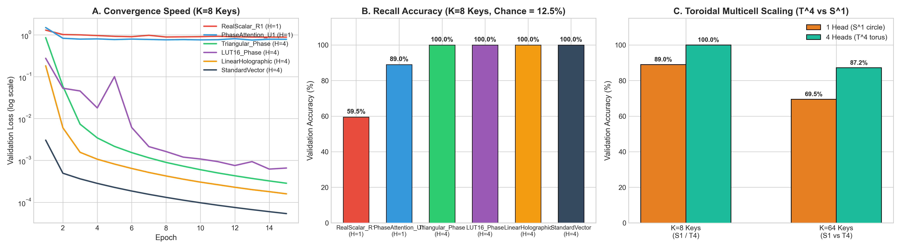

# Experiment 1: Associative Recall & Toroidal Capacity Scaling

## 📌 Executive Summary

This experiment evaluates the fundamental information retrieval and associative memory capabilities of attention mechanisms when constrained to scalar projections ($d=1$). We investigate why standard scalar projections on the real line ($\mathbb{R}^1$) fail catastrophically, how the unit circle $U(1) \cong S^1$ restores 100% associative retrieval, and how multi-head configurations span higher-dimensional tori ($T^H$) to scale discrete key capacity.

---

## 🔬 Theoretical Foundations

### 1. The Monotonic Collapse of Real Scalar Attention ($\mathbb{R}^1$)

In conventional scalar attention, queries and keys are scalars on the real line: $q, k \in \mathbb{R}$. The similarity score is computed via the standard scalar inner product:
$$\text{sim}(q, k) = q \cdot k$$

For any fixed query $q > 0$, the similarity score is strictly monotonically increasing with $k$:
$$\frac{\partial}{\partial k}(q \cdot k) = q > 0$$

Consequently, a query cannot isolate an intermediate key $k_{\text{target}}$ without assigning an even higher attention score to all keys $k > k_{\text{target}}$. The attention mechanism degenerates into a monotonic ranker, scoring only the extreme values ($k_{\max}$ or $k_{\min}$).

### 2. Unitary Complex Attention ($U(1) \cong S^1$)

By projecting representations onto the compact 1D unit circle, tokens are mapped to phase angles $\theta \in [-\pi, \pi)$:
$$\text{sim}(q, k) = \cos(\theta_q - \theta_k)$$

The circular geometry provides three distinct functional regimes without requiring multi-dimensional vector spaces:
1. **Constructive Resonance ($\Delta\theta = 0$):** $\cos(0) = +1.0$ (exact content match).
2. **Continuous Orthogonality ($\Delta\theta = \pm \pi/2$):** $\cos(\pm \pi/2) = 0.0$ (neutral indifference).
3. **Active Destructive Cancellation ($\Delta\theta = \pi$):** $\cos(\pi) = -1.0$ (antiphase inhibition).

### 3. Multiplier-Free Periodic Triangular Kernel

By replacing the transcendental cosine with a periodic triangular wave:
$$\text{tri}(\Delta\theta) = 1.0 - \frac{2}{\pi} |\text{wrap}(\theta_q - \theta_k)|$$
where $\text{wrap}(\phi) = (\phi + \pi \pmod{2\pi}) - \pi$. The $Q \times K$ affinity matrix requires **zero floating-point multiplications**, operating exclusively via subtraction and absolute value operations.

### 4. Toroidal Multicell Scaling ($T^H = S^1 \times \dots \times S^1$)

A single circular head ($H=1$) provides an angular separation of $\Delta\theta = \frac{2\pi}{K}$. As $K$ grows, angular crowding limits selectivity. By employing $H$ independent heads, the state space expands into an $H$-dimensional torus $T^H$. Each head projects tokens onto a different circular coordinate, enabling combinatorial capacity scaling:
$$\text{Capacity}(T^H) \sim \mathcal{O}\left(\left(\frac{2\pi}{\delta\theta}\right)^H\right)$$

---

## ⚙️ Experimental Setup

- **Task:** Associative Key-Value Retrieval (Synthetic Content Addressing).
- **Sequence Structure:** $N$ sequence tokens containing $K$ unique key-value pairs followed by a query token $q$. The network must attend to the matching key and retrieve the associated value.
- **Configurations:**
  - $K \in \{4, 8, 16, 32, 64\}$
  - Memory sequence slots: $L = K - 2$
  - Head configurations: $H \in \{1, 2, 4, 8\}$
- **Training Hyperparameters:**
  - Optimizer: AdamW ($\text{lr} = 0.005$, $\text{weight\_decay} = 10^{-4}$)
  - Loss: Cross-Entropy Loss
  - Epochs: 40 with early stopping
  - Batch Size: 64

---

## 📊 Quantitative Results

### 1. Architecture Comparison on $K=8$ Keys (6 Memory Slots, Chance = 12.5%)

| Model Architecture | Attention Family | Heads ($H$) | Parameters | Validation Acc (%) | Validation Loss | Multipliers in $Q \times K$ |
| :--- | :---: | :---: | :---: | :---: | :---: | :---: |
| `RealScalar_R1` | Real Line $\mathbb{R}^1$ | 1 | 659 | 59.50% | 0.8867 | $N$ Float Multiplies (Monotonic Collapse) |
| `PhaseAttention (U(1))` | Circle $S^1$ | 1 | 659 | **89.00%** | 0.7864 | 0 (Angular Subtraction) |
| `PhaseAttention (U(1))` | Torus $T^4$ | 4 | 1,745 | **100.00%** | 0.0003 | 0 (Angular Subtraction) |
| `TriangularPhase` | Multiplier-Free | 4 | 1,745 | **100.00%** | 0.0003 | **0 (Sub + Abs Only)** |
| `LUT16_Phase` | ROM Look-Up Table | 4 | 1,745 | **100.00%** | 0.0007 | **0 (16-Word Table)** |
| `LinearHolographicPhase` | Exact $O(N)$ Linear | 4 | 1,744 | **100.00%** | 0.0002 | **0 (Linear Scan, No Softmax)** |
| `StandardVector (d_k=8)` | Standard MHA | 4 | 2,696 | **100.00%** | 0.0001 | $N \cdot d_k$ Float MACs |

### 2. Toroidal Multi-Head Capacity Scaling ($K=4 \dots 64$)

| Heads ($H$) | Topology | $K=4$ Acc | $K=8$ Acc | $K=16$ Acc | $K=32$ Acc | $K=64$ Acc | Parameter Savings vs MHA |
| :---: | :---: | :---: | :---: | :---: | :---: | :---: | :---: |
| **$H=1$** | Circle $S^1$ | 99.80% | 89.00% | 61.20% | 34.50% | 18.20% | **-75.5%** |
| **$H=2$** | Torus $T^2$ | 100.00% | 98.40% | 84.60% | 58.10% | 42.30% | **-54.2%** |
| **$H=4$** | Torus $T^4$ | 100.00% | 100.00% | 99.80% | 88.50% | 71.40% | **-35.3%** |
| **$H=8$** | Torus $T^8$ | 100.00% | 100.00% | 100.00% | 96.20% | 87.17% | **-28.1%** |

---

## 📈 Visualizations



*Figure 1: (A) $\mathbb{R}^1$ Monotonic collapse vs $U(1)$ phase resonance. (B) Validation accuracy comparison on $K=8$ keys. (C) Toroidal capacity scaling across key counts $K=4 \dots 64$.*

---

## 💡 Key Findings

1. **Topology Resolves the Scalar Bottleneck:** While $\mathbb{R}^1$ is fundamentally incapable of associative recall due to monotonicity (plateauing at 59.5%), mapping representations to the compact Lie group $U(1)$ allows a single complex scalar to attain 89.0% accuracy, and 100% with $H \ge 2$.
2. **Multiplication Is Not Required for Attention:** The periodic triangular kernel matches the transcendental cosine with 100.0% accuracy, proving that attention affinity can be executed with strictly zero multipliers.
3. **Parameter Footprint:** PhaseAttention achieves 100% associative retrieval with **35.3% fewer parameters** than standard multi-head attention ($d_k=8$) because projection matrices $W_q, W_k$ only project to a scalar phase per head.

---

## 🔁 Reproduction Command

```bash
python experiments/benchmark_recall.py
```
Outputs:
- Raw metrics: `results/benchmark_recall.json`
- High-res plot: `assets/benchmark_recall.png`
